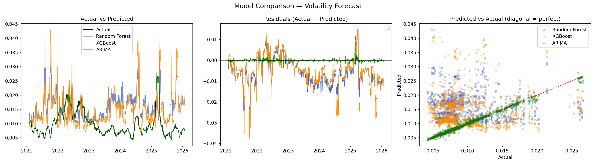

# S&P 500 Volatility Forecasting

Predicting 30-day ahead realized volatility of the S&P 500 using machine learning and statistical models, with a focus on regime shifts and model adaptability in time series data.

##  Problem Overview

Volatility measures how much prices fluctuate and is a critical signal in financial markets.

Predicting volatility 30 days into the future is challenging because:

Financial time series are noisy and non-stationary

Market conditions change over time (regime shifts)

Long-term historical data may introduce bias

This project explores how different models behave under these conditions.

##  Key Idea

Models trained on long historical periods may fail to adapt to current market conditions.

This project compares:

Machine learning models trained on long static datasets

A statistical model using rolling, short-term memory

##  System Overview

The pipeline is designed as a modular ML system:

Data Ingestion → Data Cleaning → Feature Engineering → Model Training → Evaluation → Reporting

Data Source: yfinance (S&P 500, starting 2000)

Processing: cleaned and transformed into structured time series

Features: lag-based, rolling statistics, and volatility indicators

Evaluation: out-of-sample testing on recent data

## 📂 Project Structure

├── data/
│   ├── raw/
│   ├── processed/
│
├── src/
│   ├── data_loader.py
│   ├── data_cleaning.py
│   ├── feature_engineering.py
│   ├── models.py
│   ├── evaluation.py
│   ├── config_loader.py
│   └── logger.py
│
├── reports/
│   └── model_comparison.png
│
├── config/
│   ├── config.yaml
│   └── logging.yaml
│
├── testing.ipynb
├── requirements.txt
└── README.md

## 🔧 Setup
pip install -r requirements.txt
python main.py

## 📊 Data

Source: S&P 500 via yfinance

Train: 2001–2021 (~20 years)

Test: 2021–2026

## 🏗️ Feature Engineering

To capture volatility dynamics:

Lag Features (vol_lag_1, vol_lag_5)
→ Volatility persistence (strong temporal dependency)

Rolling Means (mean_5, mean_10, mean_30)
→ Noise reduction and trend smoothing

Price Range ((high - low) / close)
→ Intraday volatility independent of closing price

Distance from Moving Average (dist_ma10, dist_ma30)
→ Deviation from recent trend

Volume Lags
→ Captures abnormal market activity

##  Models
🌳 Random Forest

Trained on full historical data (2001–2021)

Uses engineered lag and rolling features

Sensitive to distribution shift

⚡ XGBoost

Boosted trees on same feature set

Slight improvement over Random Forest

Still affected by regime bias

📈 ARIMA (1,0,1)

Univariate time series model

Uses rolling 252-day window (~1 year)

Retrains at each step (walk-forward style)

## 📊 Results
Model	MAE
Baseline	0.003450
Random Forest	0.007315
XGBoost	0.006988
ARIMA	0.000284

## See visualization: reports/model_comparison.png

## 🔍 Key Findings
1. Regime Shift Problem in ML Models

Tree-based models trained on long historical windows:

Learn from outdated market regimes (e.g., 2008 crisis, COVID)

Produce biased predictions toward high volatility

Fail to adapt to current market conditions

2. Rolling Models Adapt Better

ARIMA significantly outperforms ML models because:

It only uses recent data (last 252 days)

Continuously adapts to the current regime

Avoids contamination from irrelevant historical patterns

3. Static Training is a Limitation

This experiment highlights a key limitation:

Standard ML pipelines with fixed training windows are not well-suited for non-stationary time series.

##  Future Improvements

Implement walk-forward validation for tree-based models

Use rolling training windows instead of static splits

Apply time-decay weighting to reduce influence of old data

Explore hybrid models (ARIMA + ML residual learning)

Compare model adaptability under different market regimes

## 🧩 Skills Demonstrated

Time series forecasting

Feature engineering for financial data

Handling non-stationarity & regime shifts

ML vs statistical model comparison

Modular ML pipeline design

Experiment analysis & interpretation