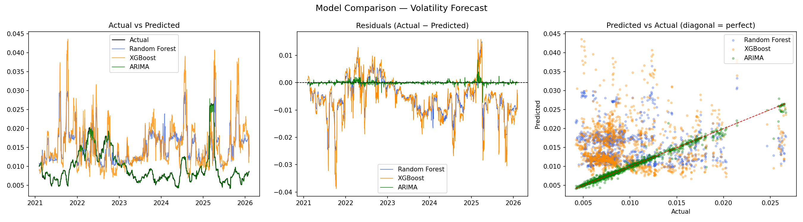
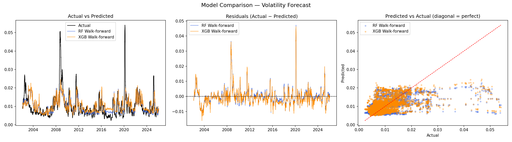

# S&P 500 Volatility Forecasting

Predicting 30-day ahead realized volatility of the S&P 500 using machine learning 
and statistical models, with a focus on regime shifts and model adaptability in 
time series data.

## Problem Overview

Volatility measures how much prices fluctuate and is a critical signal in financial 
markets. Predicting volatility 30 days into the future is challenging because:

- Financial time series are noisy and non-stationary
- Market conditions change over time (regime shifts)
- Long-term historical data may introduce bias toward outdated patterns

This project explores how different models behave under these conditions and 
demonstrates why evaluation methodology matters as much as model choice.

## Key Idea

Models trained on long historical periods may fail to adapt to current market 
conditions. This project compares static ML training against rolling/adaptive 
approaches and shows the performance gap between them.

## Pipeline

Data Ingestion → Cleaning → Feature Engineering → Model Training → Evaluation → Reporting

Running `python main.py` executes the full pipeline automatically, including 
downloading data from yfinance.

## Project Structure

\`\`\`
├── data/
│   ├── raw/
│   └── processed/
├── src/
│   ├── data_loader.py
│   ├── data_cleaning.py
│   ├── feature_engineering.py
│   ├── models.py
│   ├── evaluation.py
│   ├── config_loader.py
│   └── logger.py
├── reports/
│   ├── model_comparison_single_split.png
│   └── model_comparison_walk_forward.png
├── config/
│   ├── config.yaml
│   └── logging.yaml
├── requirements.txt
└── README.md
\`\`\`

## Setup

\`\`\`bash
pip install -r requirements.txt
python main.py  # downloads data automatically and runs full pipeline
\`\`\`

## Data

- Source: S&P 500 via yfinance, starting 2000-01-01
- Train: 2001–2021 (~5000 trading days)
- Test: 2021–2026 (~1257 trading days)

## Feature Engineering

| Feature | Description |
|---|---|
| `vol_lag_1/5/21/63/252` | Volatility memory across trading day, week, month, quarter, year |
| `return_lag_1/5/21/63` | Lagged log returns for momentum signals |
| `mean_5/10/30` | Rolling means for noise reduction and trend smoothing |
| `range` | (high - low) / close — intraday volatility signal |
| `dist_ma10/ma30` | Distance from moving average — deviation from trend |
| `volume_lag_1/5` | Lagged volume for abnormal activity detection |

Log returns are used instead of simple returns because they are additive across 
time and statistically better behaved over decades of data.

The target `y` is the realized volatility of the **next 30 trading days**, computed 
as a fully future rolling standard deviation of log returns — ensuring zero overlap 
with any feature window.

## Models

**Random Forest & XGBoost (Single Split)**  
Trained once on 2001–2021, evaluated on 2021–2026. Sensitive to distribution shift 
between training and test periods.

**Random Forest & XGBoost (Walk-forward)**  
Retrained on an expanding window every 630 trading days (~2.5 years). Each fold only 
predicts the next period it hasn't seen, matching how models would be used in practice.

**ARIMA (1,0,1) — Rolling Forecast**  
Univariate model using a fixed 252-day window (~1 trading year). Retrains at every 
single step, always reflecting the most recent volatility regime.

## Results

| Model | MAE | R² | Notes |
|---|---|---|---|
| Baseline (rolling mean) | 0.003450 | — | Predict last 21-day mean |
| Random Forest (single split) | 0.007315 | -2.74 | Worse than baseline |
| XGBoost (single split) | 0.006988 | -3.78 | Worse than baseline |
| **Random Forest (walk-forward)** | **0.003800** | **0.211** | Competitive with baseline |
| **XGBoost (walk-forward)** | **0.003646** | **0.216** | Competitive with baseline |
| **ARIMA (rolling forecast)** | **0.000283** | — | 12x better than baseline |

### Single Split Evaluation (2021–2026)
RF and XGBoost trained once on 20 years of data — both models predict too high 
because they learned from crisis periods (2008, COVID) that don't reflect 2021–2026.
ARIMA tracks the actual volatility closely throughout.

### Walk-forward Evaluation (2001–2026)
Both tree models retrained on expanding windows — predictions now track actual 
volatility across the full date range including the 2008 crisis and 2020 COVID crash.

## Key Findings

**1. Evaluation methodology matters more than model choice**  
The same Random Forest goes from MAE 0.007315 (worse than baseline) to 0.003800 
(competitive with baseline) just by changing from single split to walk-forward 
validation. The model didn't change — how it was evaluated did.

**2. Regime shift is the core problem**  
Models trained on 2001–2021 learned that high volatility (0.03–0.05) is normal 
because of 2008 and COVID. The 2021–2026 test period is calmer. The model 
permanently overpredicts because its training distribution doesn't match the 
current regime — the same way prices from 2001 tell you nothing about what 
things cost today.

**3. Short memory beats long memory for volatility**  
ARIMA with a 252-day window outperforms everything by a large margin. Volatility 
is strongly autocorrelated at short lags — yesterday's volatility is the best 
predictor of today's. Data from 5 years ago adds noise, not signal.

**4. Walk-forward R² reveals regime sensitivity**  
Per-fold R² ranges from -15 to +0.38 depending on whether the training period 
contains a comparable regime to the test period. This variance is the honest 
picture of how uncertain volatility forecasting actually is.

## Limitations

- ARIMA comparison isn't perfectly apples-to-apples — it does rolling 1-step 
  prediction while tree models predict a fixed 30-day horizon in one shot
- Tree models evaluated with walk-forward still struggle during structural breaks 
  like 2008 where no comparable training examples exist
- No macroeconomic features (VIX, interest rates) which would likely improve 
  regime detection

## Skills Demonstrated

- Time series forecasting with proper temporal validation
- Walk-forward cross-validation implementation from scratch
- Data leakage detection and prevention in financial features  
- Distribution shift diagnosis and mitigation
- Modular ML pipeline design with config-driven architecture
- Statistical vs ML model comparison and honest evaluation